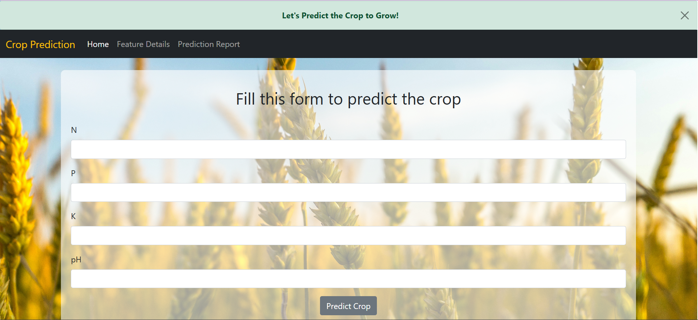

# Flask_Project
This is a Flask-based web application that predicts the most suitable crop to grow based on soil nutrients and pH values. The model uses input features such as Nitrogen (N), Phosphorous (P), Potassium (K), and pH level to make predictions.

---

## Features

- Simple and clean user interface using HTML/CSS
- Crop prediction using machine learning
- Input form for soil nutrient data (N, P, K, pH)
- Instant prediction output

---

## Screenshot

---

## Tech Stack

- **Frontend:** HTML, CSS (with Bootstrap or custom styling)
- **Backend:** Python, Flask
- **Machine Learning Model:** Trained using Scikit-learn / pandas / NumPy

